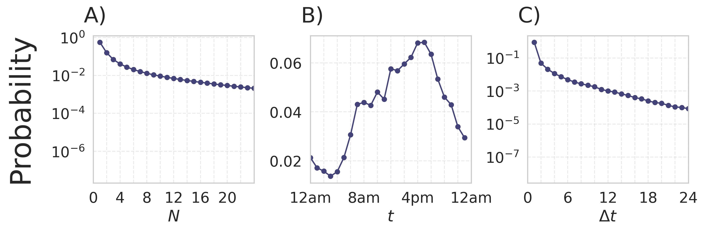
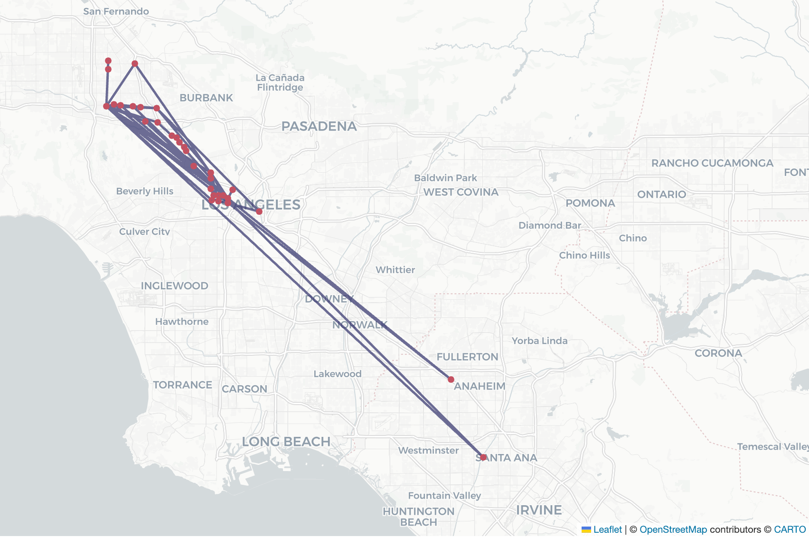
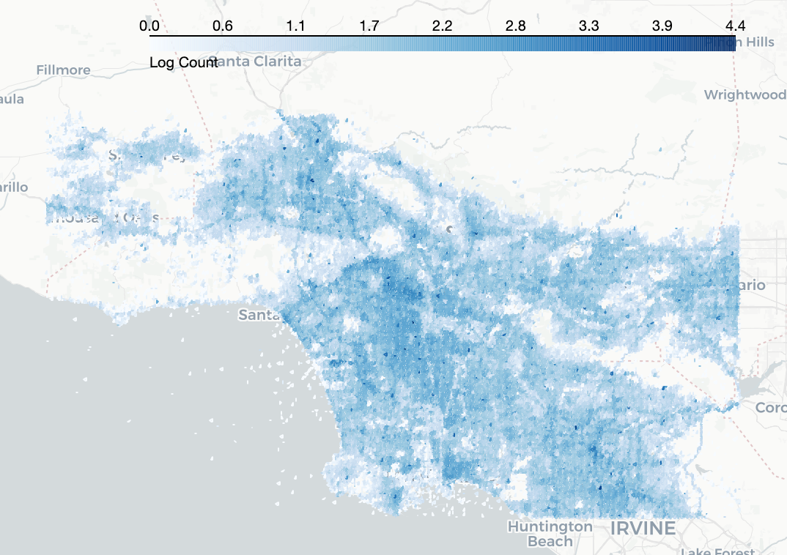
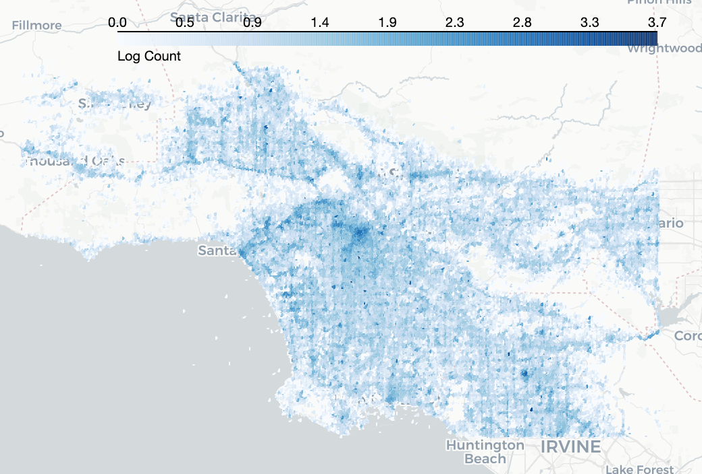

<!-- [](https://zenodo.org/badge/latestdoi/184337448)


 -->


<div style="display: flex; align-items: center; justify-content: flex-start;">
  
  <h1 style="margin: 0; text-align: left;">sparkmobility - A Spark-based Python Library for Processing, Modeling, and Analyzing Large Mobility Datasets</h1>
</div>

<!-- ###### Try `scikit-mobility` without installing it
[](https://twitter.com/scikitmobility)

- in a MyBinder notebook: [](https://mybinder.org/v2/gh/scikit-mobility/scikit-mobility/master)
- on [Jovian](https://jovian.ai/jonpappalord/collections/scikit-mobility-tutorial) -->


`sparkmobility` is a library for processing large mobility dataset, including Location-Based Service (LBS) using the [Apache Spark](https://spark.apache.org) framework. This Python repository serves as the main interface between `sparkmobility` and users. The Scala repository holds various data processing pipelines which can be found at [sparkmobility-scala](https://github.com/humnetlab/sparkmobility-scala).

Key features of `sparkmobility` include:

- Apache Spark-based implementation of the stay detection algorithm published by [Zheng et al. (2010)](https://dl.acm.org/doi/10.1145/1772690.1772795).

- Inference of home and work locations.

- Extract and visualize mobility metrics and patterns from the stay points output by the stay detection algorithm.

- Generate synthetic trajectories and OD flow patterns using the detected stay points and human mobility models including gravity model, rank-based EPR model, and TimeGeo.


## Table of contents
<!-- 1. [Documentation](#documentation)
2. [Citing](#citing)
3. [Collaborate with us](#collaborate) -->
<!-- 4. [Installation](#installation)
	- [with pip](#installation_pip)
	- [with conda](#installation_conda)
	- [known issues](#known_conda)
	- [test installation](#test_installation)
	- [Google Colab](#google_colab)
5. [Tutorials](#tutorials) -->
1. [Examples](#examples)
	- [Import and configure sparkmobility](#Import)
	- [MobilityDataset](#MobilityDataset)
	- [StayDetection](#StayDetection)
	- [UserSelection](#UserSelection)

<!--
<a id='documentation'></a>
## Documentation
The documentation of scikit-mobility's classes and functions is available at: https://scikit-mobility.github.io/scikit-mobility/

<a id='citing'></a>
## Citing

if you use scikit-mobility please cite the following paper:

Pappalardo, L., Simini, F., Barlacchi, G., & Pellungrini, R. (2022). scikit-mobility: A Python Library for the Analysis, Generation, and Risk Assessment of Mobility Data. Journal of Statistical Software, 103(1), 1–38. https://doi.org/10.18637/jss.v103.i04

Bibtex:
```
@article{JSSv103i04,
 title={scikit-mobility: A Python Library for the Analysis, Generation, and Risk Assessment of Mobility Data},
 volume={103},
 url={https://www.jstatsoft.org/index.php/jss/article/view/v103i04},
 doi={10.18637/jss.v103.i04},
 number={1},
 journal={Journal of Statistical Software},
 author={Pappalardo, Luca and Simini, Filippo and Barlacchi, Gianni and Pellungrini, Roberto},
 year={2022},
 pages={1–38}
}
```

<a id='collaborate'></a>
## Collaborate with us
`scikit-mobility` is an active project and any contribution is welcome.

If you would like to include your algorithm in `scikit-mobility`, feel free to fork the project, open an issue and [contact us](mailto:scikit.mobility@gmail.com).


<a id='installation'></a>
## Installation
scikit-mobility for Python >= 3.8 and all it's dependencies are available from conda-forge and can be installed using
`conda install -c conda-forge scikit-mobility`.

Note that it is **NOT recommended** to install scikit-mobility from PyPI! If you're on Windows or Mac, many GeoPandas / scikit-mobility dependencies cannot be pip installed (for details see the corresponding notes in the GeoPandas documentation).

<a id='installation_pip'></a>
### installation with pip (python >= 3.8 required)

1. Create an environment `skmob`

        python3 -m venv skmob

2. Activate

        source skmob/bin/activate

3. Install skmob

        pip install scikit-mobility

4. OPTIONAL to use `scikit-mobility` on the jupyter notebook

	- Activate the virutalenv:

			source skmob/bin/activate

	- Install jupyter notebook:

			pip install jupyter

	- Run jupyter notebook

			jupyter notebook

	- (Optional) install the kernel with a specific name

			ipython kernel install --user --name=skmob


<a id='installation_conda'></a>
### installation with conda - miniconda

1. Create an environment `skmob` and install pip

        conda create -n skmob pip python=3.9 rtree

2. Activate

        conda activate skmob

3. Install skmob

        conda install -c conda-forge scikit-mobility

4. OPTIONAL to use `scikit-mobility` on the jupyter notebook

    - Install the kernel

          conda install jupyter -c conda-forge

    - Open a notebook and check if the kernel `skmob` is on the kernel list. If not, run the following:
    	- On Mac and Linux

          	  env=$(basename `echo $CONDA_PREFIX`)
          	  python -m ipykernel install --user --name "$env" --display-name "Python [conda env:"$env"]"

       - On Windows

             python -m ipykernel install --user --name skmob --display-name "Python [conda env: skmob]"

:exclamation: You may run into dependency issues if you try to import the package in Python. If so, try installing the following packages as followed.

```
conda install -n skmob pyproj urllib3 chardet markupsafe
```

<a id='test_installation'></a>
### Test the installation

```
> source activate skmob
(skmob)> python
>>> import skmob
>>>
```

<a id='google_colab'></a>
## Google Colab
scikit-mobility can be installed on <a href="https://colab.research.google.com/notebooks/intro.ipynb#recent=true">Google Colab</a> using the following commands:
```
!apt-get install -qq curl g++ make
!curl -L http://download.osgeo.org/libspatialindex/spatialindex-src-1.8.5.tar.gz | tar xz
import os
os.chdir('spatialindex-src-1.8.5')
!./configure
!make
!make install
!pip install rtree
!ldconfig
!pip install scikit-mobility
```

<a id='tutorials'></a>
## Tutorials
You can some tutorials on scikit-mobility here: https://github.com/scikit-mobility/tutorials. -->

<a id='examples'></a>
## Examples

<a id='Import'></a>
### Import and configure `sparkmobility`

To import `sparkmobility`, simply call the following:

```python
>>> import sparkmobility as sm
>>> sm.config["CORES"] = 8
>>> sm.config["MEMORY"] = 32
>>> sm.config["LOG_LEVEL"] = "ERROR"
>>> sm.config["TEMP_DIR"] = "/my_path/to_tmp_folder"
```

    JAR file not found at /data_1/albert/sparkmobility/sparkmobility/lib/sparkmobility010.jar. Downloading from GCS...
    Download complete.
    Spark already installed.
    Environment variables set for current session.
    To make this persistent, add the following to your shell config (e.g., .bashrc):
    export SPARK_HOME="/home/albert/.spark/spark-3.5.5-bin-hadoop3-scala2.13"
    export PATH="$SPARK_HOME/bin:$PATH"

Spark sessions can be configured through the `sparkmobility` configuration file. They include:

- `sm.config['CORES']` sets the number of CPU cores for the parallelism in spark ;
- `sm.config['MEMORY']` sets the amount of memory allocated for both the executor and driver in spark ;
- `sm.config['LOG_LEVEL']` sets the level of messages during compue; ;
- `sm.config['TEMP_DIR']` sets the path to the directory that holds the temporary files when running the pipelines. It is important to set it to a directory that has sufficient storage in disk to prevent out of storage error.

When imported for the first time, `sparkmobility` automatically searches for the `.jar` file that contains the pre-compiled pipelines developed in Scala. If not, `sparkmobility` automatically downloads from Google Cloud Storage.


<a id='MobilityDataset'></a>
### Initialize a `MobilityDataset`

In sparkmobility, the class `MobilityDataset` describes the mobility dataset. It does NOT hold the raw data or the detected stay points in memory but store various attributes of the dataset. The mandatory input fields include:

- `dataset_name` (type: str) ;
- `raw_data_path` (type: str) ;
- `processed_data_path` (type: str) ;
- `column_mappings` (type: dict) ;

Additionally, it is optional to define the time period and region of interests, which help reduce the computation time during the stay detection phase by selecting a subset of records:
- `start_datetime` (type: datetime) ;
- `end_datetime` (type: datetime) ;
- `longitude` (type: list);
- `laitude` (type: list);
- `time_zone` (type: str) specifies the local time zone of the region of interest.


Initialize a `MobilityDataset`:

```python
>>> from sparkmobility.datatset import MobilityDataset
>>> # create a MobilityDataset
>>> myDataset = MobilityDataset(
        dataset_name="example_dataset",
        raw_data_path="example_dataset_raw_lbs",
        processed_data_path="example_dataset_output",
        column_mappings={"caid": "caid",
                         "latitude": "latitude",
                         "longitude": "longitude",
                         "utc_timestamp": "utc_timestamp"},
        start_datetime="2019-01-01 00:00:00",
        end_datetime="2025-01-31 23:59:59",
        longitude=[-118.9448, -117.6463], # LA region
        latitude=[33.7037, 34.3373],
        time_zone="America/Los Angeles",
    )
```

```python
>>> print(type(myDataset))
```
	<class 'sparkmobility.datatset.MobilityDataset'>


<a id='StayDetection'></a>
### Conduct `StayDetection`

`StayDetection` is a process for detecting the stay points and their respective stay duration from the raw mobility dataset, which comes in the format of (USER_ID, TIME, LNG, LAT). To call `StayDetection`:

```python
>>> from sparkmobility.processing.stay_detection import StayDetection
# Initialize the StayDetection instance
>>> stays = StayDetection(MobilityDataset=myDataset)
# Conduct stay detection
>>> stays.get_stays(hex_resolution=9)
# Compute OD flow matrix for trips between home and work locations
>>> stays.get_home_work_od_matrix(hex_resolution=7)
# Compute mobility distributions
>>> stays.summarize()
```

Argument `hex_resolution` specifies the resolution of the hexagonal grids in the output data. The output of the `StayDetection` module is automatically saved to the directory `processed_data_path` when `MobilityDataset` is first initialized. The structures are:

```
📦 processed_data_path
 ┣ 📂 HomeWorkODMatrix
 ┃ ┗ 📂 Resolution7
 ┣ 📂 Metrics
 ┃ ┣ 📂 DailyVisitedLocations
 ┃ ┣ 📂 DepartureTimeDistribution
 ┃ ┗ 📂 StayDurationDistribution
 ┣ 📂 StayPoints
 ┣ 📂 StayPointsWithHomeWork
 ┗ 📜 config.json
```

To visualize the output of `StayDetection`, we can call the following visualization functions:


#### Plot mobiilty distributions:
```python
>>> from sparkmobility.visualization.population import plot_mobility_distributions
# plot distribution of the number of daily visited locations N, the depature time t, and the stay duration delta_t
>>> fig, ax = plot_mobility_distributions(myDataset)
```



#### Plot home work OD flow:
```python
>>> from sparkmobility.visualization.population import plot_flow
# Load the OD flow matrix for trips between home and work locations
>>> flow_df = myDataset.load_home_work_flow(hex_resolution=7).toPandas()
# Plot the flow
>>> plot_flow(flow_df[flow_df["flow"] > 20])
```


#### Plot user trajectories:

```python
>>> import pyspark.sql.functions as F
>>> from sparkmobility.visualization.individual import plot_trajectories
# Load detected stay points
>>> stay_points = myDataset.load_stays()
# Filter for a user's trajectory
>>> stay_points = stay_points.filter(
        F.col("caid") == "0006e4cac5385960141fee505fbb73922c27309b34c45a8c5bb0bf03ace****"
    ).toPandas()
>>> plot_trajectories(stay_points)
```



#### Plot distribution of home and work locations

```python
myDataset.plot_home_locations(hex_resolution=9)
```



```python
myDataset.plot_work_locations(hex_resolution=9)
```


<a id='UserSelection'></a>
### Select active users using `UserSelection` based on stay points

The `UserSelection` modules filters the users in the stay points dataset based on the active timespan of each user and the number of stay points detected:

- `num_stay_points_range` type(list) ;
- `time_span_days_range` type(list) ;

The method `UserSelection.filter_users` returns a visualization of the number of users by the criteria and saves the stay points of the selected users to `processed_data_path/FilteredUserStayPoints`

```python
>>> from sparkmobility.processing.user_selection import UserSelection
# Create an instance variable for the UserSelection module
>>> user_selection = UserSelection(myDataset)
# Filter users based on the number of stay points and the active timespan
>>> fig, ax = user_selection.filter_users(
        num_stay_points_range=[100, 800],
        time_span_days_range=[15, 30]
    )
```


# Related packages
[*scikit-mobility*](https://github.com/scikit-mobility/scikit-mobility) is a similar package that deals with mobility datasets. *scikit-mobility* uses two data structures, trajectories (`TrajDataFrame`) and mobility flows (`FlowDataFrame`), to manage, analyze, and model human mobility data. Instead of using pandas, `sparkmobility` levearges Apache Spark. The input mobility data are structured as Resilient Distributed Dataset (RDD) during processing. The gravity and ranked-based EPR models implemented in `sparkmobility` are adopted from *scikit-mobility* implementations.
